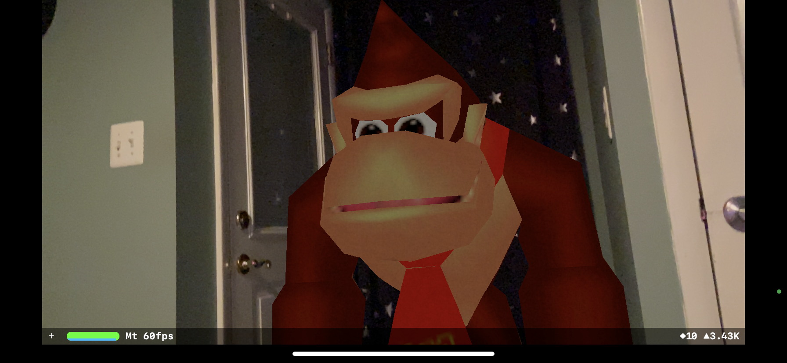
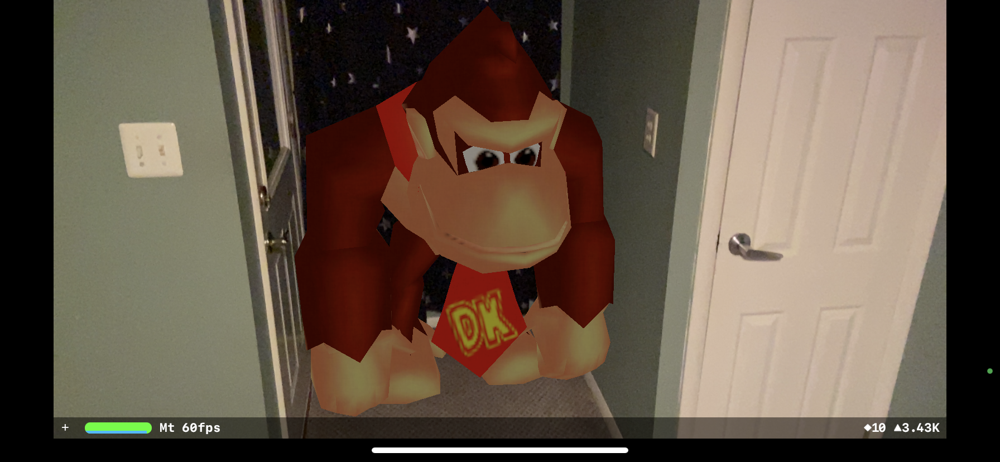
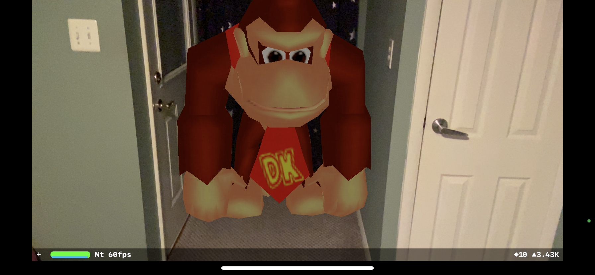

# IOS Donkey Kong AR
  
  ## Table of Contents
  * [Description](#description)
  * [Sneak-Peek](#sneak-peek)
  * [Contributing](#contributing)
  * [Questions?](#questions)
  
  
  ## Description
This is a little fun project I made during my time in the App Development class (CS 305) at STAC. We were tasked to create an AR app that displays any 3D object of our choosing. Of course, I chose the leader of the bunch, as he is my favorite character and the N64 model always is a pleasure to see. The AR app is pretty simplistic, but gets the job done. Note, this was made in XCode using Swift, so it only works for IOS devices. Model was pulled from [this](https://www.modelsresource.com/nintendo_64/donkeykong64/model/4909/) website.
  
  ## Sneak-Peek

  

    
  

  
  

    
  

  
  

    
  

  
  

    
  

  
  

    
  

  
  ## Contributing
  
  Contributions are always accepted. There is never no room for improvement. 
  
  ---
  
  ## Questions?
  
   
  
  For any business related questions, please contact me through my email:
  
  Email: txhakli@gmail.com
  
  For just chatting and getting to know me on an unprofessional level:
  
  Discord: taulant#1999
